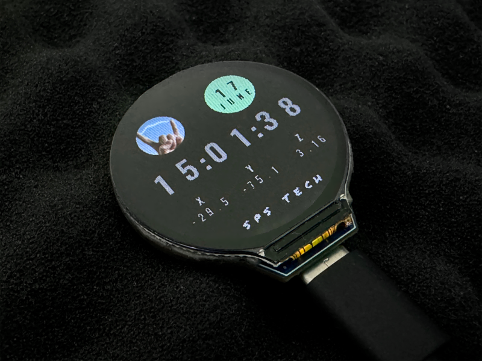
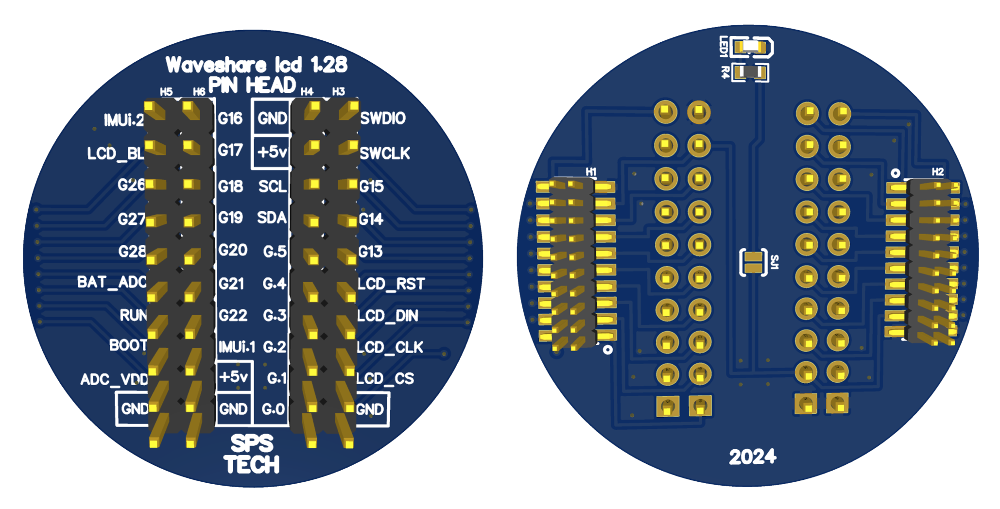

# RP2040 LCD 1.28 Graphics


---

## About
This project based on [pico-cmake-project](https://github.com/sps-tech-lab/pico-cmake-project) 
and [Waveshare RP2040-LCD-1.28](https://www.waveshare.com/wiki/RP2040-LCD-1.28) board.

Features:
- LCD driver
- Basic graphical methods
- Fonts converter
- Extensive boards support (on cmake level)
- QMI8658 IMU library



Demo extensive board (production files are included)


---

## Getting Started with pico-cmake-project
After cloning the repo, run:

```
python3 scripts/generate_presets.py --generator Ninja
```
This will produce CMakePresets.json from CMakePresets.json.def using your generator

```Ninja / "Unix Makefiles" / "Visual Studio 17 2022" / "MinGW Makefiles"```

#### Clion 
In CLion go: 
```Settings``` → ```Build, Execution, Deployment``` → ```CMake```
and choose one of profiles. If there is no one that satisfy you, 
create a new in CMakePresets.json.def and run ```bootstrap_presets.py ```again

#### Command Line
For command line it would be:
```
cmake --preset Waveshare_rp2040_lcd_1.28
cmake --build --preset Waveshare_rp2040_lcd_1.28
```

After it, edit `CMakeLists.txt` in `<root_folder>`:
```cmake
# rename
project(pico-cmake-project)
# to
project(your_project_name)
```

---

## Dependencies

For this project [pico-sdk](https://github.com/raspberrypi/pico-sdk) is supposed to be placed in the same directory as the ```project folder``` placed

---

### Compiler

In the latest Pico-SDK workflow the SDK does not bundle its own compiler—you’re expected to install and manage 
the ARM GCC toolchain yourself.

#### MacOS

Install the ARM Embedded GCC toolchain
```shell
# Homebrew
brew tap ArmMbed/homebrew-formulae
brew install arm-none-eabi-gcc cmake

# Ports
sudo port selfupdate
sudo port install arm-none-eabi-gcc arm-none-eabi-binutils
```
By default MacPorts binaries live in /opt/local/bin, so in your shell init (e.g. ~/.zshrc) you should have:
```export PATH=/opt/local/bin:/opt/local/sbin:$PATH```

Once arm-none-eabi-gcc is on your PATH and PICO_SDK_PATH is set, the Pico-SDK’s CMake logic will automatically pick
the correct pico_arm_cortex_m0plus_gcc.cmake toolchain file, and your macOS build should succeed just like on Windows.


#### Windows

1. **Install the ARM GNU Toolchain**

    - **Chocolatey** (recommended because it also gives you `cmake` and `ninja` in one shot):

      ```powershell
      choco install gcc-arm-embedded cmake ninja
      ```

    - **Manual installer** (if you don’t use Chocolatey):

        1. Download the latest *“Arm GNU Toolchain for Windows”* ZIP from  
           <https://developer.arm.com/downloads/-/gnu-rm>.
        2. Extract to `C:\ArmGCC`.
        3. Add the `bin` folder to your *System* `PATH` (e.g. `C:\ArmGCC\bin`).

2. **Verify the toolchain is visible**

   ```powershell
   arm-none-eabi-gcc --version
   ```
   You should see the version banner instead of “command not found.”