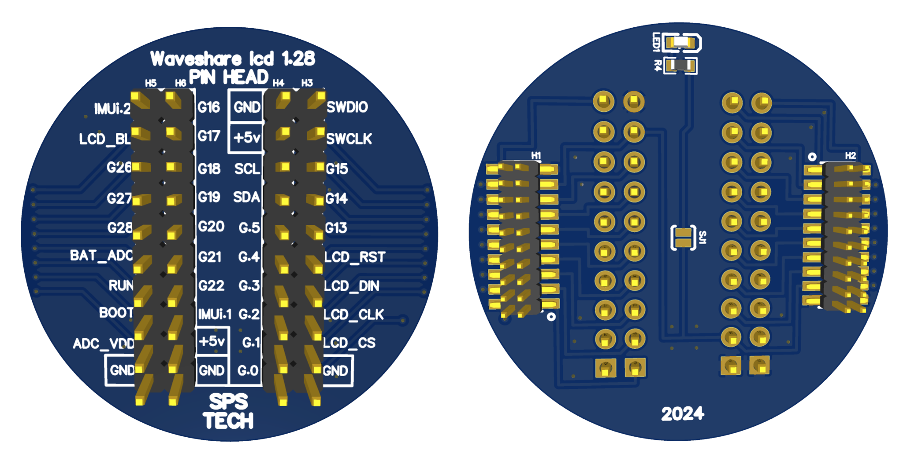
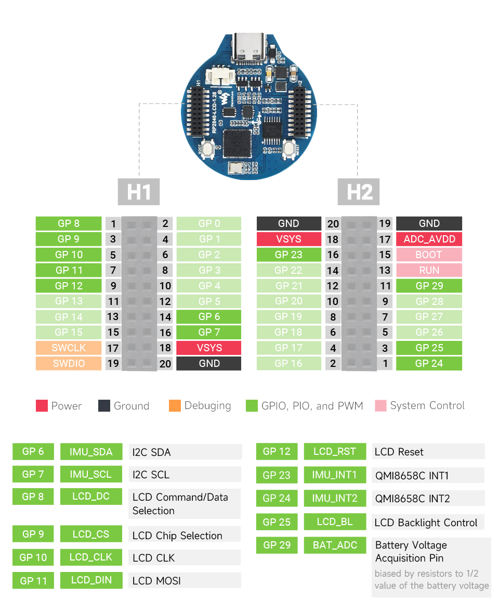

# Waveshare lcd 1.28 PinHead board

Here is extension board that gives acces to all available pins for debug, exploring connecting external sensors

#### Production
Use EasyEDA to open production file and generate gerber files

- PCB_waveshare_lcd_1.28_pin_head_2025-06-13.json
- SCH_waveshare_lcd_1.28_pin_head_2025-06-13.json

> [!IMPORTANT]
> Be careful, there is no key to prevent wrong connection on the "Waveshare RPxx LCD 1.28" board.
> Check "Waveshare RPxx LCD 1.28" pinout before connect it.

